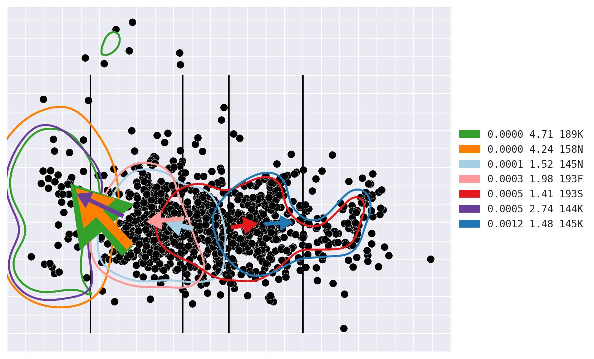

# MapDeduce

A python library for:

-   Handling antigenic maps and sequence data.
-   Testing associations between amino acid polymorphisms and antigenic
    diversity.
-   Plotting antigenic maps.



# Installation

```bash
git clone https://github.com/acorg/MapDeduce.git
cd ./MapDeduce
pip install -r ./requirements-min.txt
pip install -e .
```
